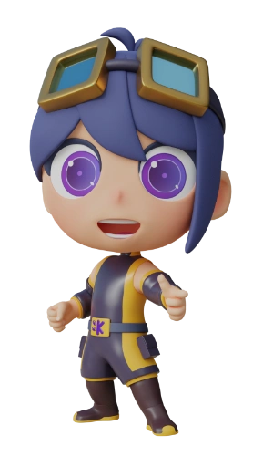
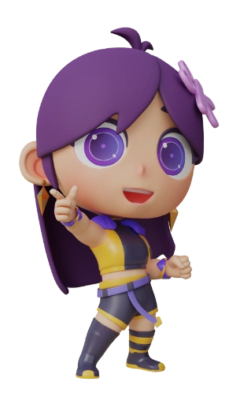

# korge-mascots

## Koral, Gest & Jitto characters are copyrighted to soywiz and the KorGE Organization

These characters are available for free to everyone to be used in free and commercial games,
fanarts and other uses, except for merchandising unless written explicit consent from soywiz.

 

## Credits:

* Jitto programmatic character, icon, logo & animations were created by [soywiz](https://soywiz.com/)
* Koral & Gest were designed by [Melted Cupcake](https://www.instagram.com/melted_cupcake/) with partial work from [soywiz](https://soywiz.com/)
* 2D layered .PSDs for Koral & Gest were created by [Melted Cupcake](https://www.instagram.com/melted_cupcake/)
* 2D Dragonbones rigging & skinning for Koral & Gest by [soywiz](https://soywiz.com/)
* 3D models for Koral & Gest by [Melted Cupcake](https://www.instagram.com/melted_cupcake/)
* HQ 3D rigging compatible with mixamo by anima0123
* Low Poly conversion of the models by [lgnr_designs](https://www.instagram.com/lgnr_designs/)
* Low Poly rigging for mixamo animations by [soywiz](https://soywiz.com/)

* Initial Koral & Gest fanart by [Lyaluya_](https://twitter.com/Lyaluya_)
